# Capacitor Camera Plugin Architecture

> **Repository:** capacitor-camera (`@capacitor/camera`)
> **Runtime Environment:** Library/SDK -- runs in user's browser (Web), Android app process, or iOS app process depending on the host Capacitor application
> **Last Updated:** 2026-03-25

## Overview

This is a Capacitor plugin that provides a cross-platform API for capturing photos, recording video, picking media from the device gallery, and editing images. The TypeScript interface layer defines a single `CameraPlugin` contract; platform-specific native implementations (Android/Kotlin+Java, iOS/Swift) and a Web fallback (TypeScript/DOM APIs) fulfil that contract at runtime via Capacitor's plugin bridge.

## Architecture Diagram

```mermaid
graph TB
    Plugin["@capacitor/camera<br/>Runs in: Host app (Browser / Android / iOS)"]

    CapBridge["Capacitor Bridge<br/>EXTERNAL"]
    OSCamera["OS Camera App<br/>EXTERNAL"]
    OSGallery["OS Photo/Video Picker<br/>EXTERNAL"]
    OSEditor["OS Image Editor<br/>EXTERNAL"]
    PhotoLibrary["Device Photo Library<br/>EXTERNAL"]
    FileSystem["Device File System / Cache<br/>EXTERNAL"]
    BrowserAPIs["Browser File & Media APIs<br/>EXTERNAL"]
    PWAElements["PWA Elements<br/>EXTERNAL"]
    IONCameraLib["IONCAMRLib (Android)<br/>EXTERNAL"]

    Plugin -->|"Native bridge calls<br/>Synchronous"| CapBridge
    Plugin -->|"Intent / UIImagePickerController<br/>Synchronous"| OSCamera
    Plugin -->|"PickVisualMedia / PHPicker<br/>Synchronous"| OSGallery
    Plugin -->|"ACTION_EDIT Intent / In-App Crop<br/>Synchronous"| OSEditor
    Plugin -->|"MediaStore / PHPhotoLibrary<br/>Synchronous"| PhotoLibrary
    Plugin -->|"File I/O, FileProvider, temp files<br/>Synchronous"| FileSystem
    Plugin -->|"File input, FileReader, Canvas<br/>Synchronous"| BrowserAPIs
    Plugin -.->|"pwa-camera-modal (optional)<br/>Synchronous"| PWAElements
    Plugin -->|"Camera, Gallery, Video, Edit managers<br/>Synchronous"| IONCameraLib

    classDef thisRepo fill:#e0f2f1,stroke:#00796b,stroke-width:3px
    classDef external fill:#ffe1e1,stroke:#d32f2f,stroke-width:2px,stroke-dasharray: 5 5
    classDef database fill:#f3e5f5,stroke:#7b1fa2,stroke-width:2px

    class Plugin thisRepo
    class CapBridge,OSCamera,OSGallery,OSEditor,PWAElements,IONCameraLib external
    class PhotoLibrary,FileSystem,BrowserAPIs database
```

## External Integrations

| External Service | Platform | Communication Type | Purpose |
|---|---|---|---|
| Capacitor Bridge (`@capacitor/core`) | All | Sync (native bridge) | Routes JS calls to the correct platform implementation; manages plugin registration |
| OS Camera App | Android, iOS | Sync (Intent / UIImagePickerController) | Capture photos and record videos via the system camera |
| OS Photo/Video Picker | Android, iOS | Sync (PickVisualMedia / PHPickerViewController) | Select media from the device gallery |
| OS Image Editor | Android | Sync (ACTION_EDIT Intent) | External image editing when `editInApp` is `false`; falls back to in-app editor |
| IONCAMRLib | Android | Sync (library call) | Ionic's internal Android camera library providing `IONCAMRCameraManager`, `IONCAMRGalleryManager`, `IONCAMRVideoManager`, `IONCAMREditManager` for new-API flows |
| Device Photo Library (MediaStore / PHPhotoLibrary) | Android, iOS | Sync (ContentResolver / Photos framework) | Save images/videos to gallery; read limited-library photos on iOS |
| Device File System / Cache | Android, iOS | Sync (File I/O, FileProvider) | Store temporary image/video files; provide content URIs to other apps |
| Browser File & Media APIs | Web | Sync (DOM APIs) | `<input type="file">`, `FileReader`, `createImageBitmap`, `Canvas`, `URL.createObjectURL` for capturing/processing photos and video metadata |
| PWA Elements (`pwa-camera-modal`) | Web | Sync (Custom Element) | Optional camera UI for web; falls back to file input if not installed |
| AndroidX ExifInterface | Android | Sync (library call) | Read/write EXIF metadata from captured or picked images |

## Architectural Tenets

### T1. A single TypeScript interface must define the contract for all platforms

Every public method available to consumers is declared in `definitions.ts` via the `CameraPlugin` interface. Android, iOS, and Web implementations must conform to this contract. This ensures that consumers write one set of calls regardless of the runtime platform, and that the public API surface is governed by a single source of truth.

**Evidence:**
- `src/definitions.ts` (in `CameraPlugin` interface) -- declares all methods: `takePhoto`, `recordVideo`, `playVideo`, `chooseFromGallery`, `editPhoto`, `editURIPhoto`, `pickLimitedLibraryPhotos`, `getLimitedLibraryPhotos`, `checkPermissions`, `requestPermissions`, plus deprecated `getPhoto` and `pickImages`
- `src/web.ts` (in `CameraWeb` class) -- `implements CameraPlugin`, providing web-specific implementations or throwing `unimplemented` for unsupported methods
- `android/.../CameraPlugin.kt` -- every `@PluginMethod` function name matches a method in the TypeScript interface
- `ios/.../CameraPlugin.swift` (in `pluginMethods` array) -- registers method names matching the TypeScript definitions

### T2. Platform-specific logic must not leak into the shared TypeScript layer

The TypeScript layer (`src/`) contains only the interface definitions, enum types, and the `registerPlugin` call. It holds zero platform-detection logic, zero Android/iOS-specific code, and delegates entirely to Capacitor's runtime plugin resolution. This keeps the published npm package lightweight and ensures native concerns stay in their respective platform directories.

**Evidence:**
- `src/index.ts` -- only calls `registerPlugin('Camera', { web: () => new CameraWeb() })`, no conditional imports or platform checks
- `src/definitions.ts` -- pure TypeScript types and enums; no runtime code
- `src/web.ts` -- implements the web fallback using only DOM/browser APIs; methods unsupported on web throw `this.unimplemented()`

### T3. Android new-API flows must delegate to IONCAMRLib managers, not perform media operations directly

The `IonCameraFlow` class (which handles all non-deprecated methods on Android) delegates camera capture, video recording, gallery selection, and image editing to dedicated manager classes from `io.ionic.libs.ioncameralib` (`IONCAMRCameraManager`, `IONCAMRVideoManager`, `IONCAMRGalleryManager`, `IONCAMREditManager`). The plugin layer is responsible only for parsing `PluginCall` options into settings objects, wiring up Android `ActivityResultLauncher` callbacks, and formatting results back into `JSObject`. This separation keeps the plugin thin and allows the underlying media library to be tested and evolved independently.

**Evidence:**
- `android/.../IonCameraFlow.kt` (in `load`) -- instantiates four separate manager objects from `io.ionic.libs.ioncameralib`
- `android/.../IonCameraFlow.kt` (in `openCamera`, `openRecordVideo`, `openGallery`) -- delegates to `cameraManager.takePhoto()`, `cameraManager.recordVideo()`, `galleryManager.chooseFromGallery()` respectively
- `android/.../IonCameraFlow.kt` (in `processResult`, `processResultFromVideo`, `processResultFromGallery`, `processResultFromEdit`) -- delegates processing to manager methods, only handling the JSObject serialization in callbacks

### T4. Deprecated API paths must be isolated from new API paths

The Android implementation maintains two completely separate flow classes: `LegacyCameraFlow` (Java) for the deprecated `getPhoto` and `pickImages` methods, and `IonCameraFlow` (Kotlin) for the new `takePhoto`, `recordVideo`, `chooseFromGallery`, `editPhoto`, and `editURIPhoto` methods. The plugin entry point (`CameraPlugin.kt`) routes each call to the appropriate flow. This isolation ensures that evolving the new API does not risk regressions in the deprecated API, and allows eventual removal of the legacy path without touching the new code.

**Evidence:**
- `android/.../CameraPlugin.kt` (in `load`) -- instantiates both `legacyFlow` and `ionFlow` as separate objects
- `android/.../CameraPlugin.kt` (in `getPhoto`) -- routes to `legacyFlow.getPhoto(call)`
- `android/.../CameraPlugin.kt` (in `takePhoto`, `recordVideo`, `chooseFromGallery`, `editPhoto`, `editURIPhoto`) -- routes to corresponding `ionFlow` methods
- `src/definitions.ts` -- deprecated methods (`getPhoto`, `pickImages`) carry `@deprecated` JSDoc annotations directing consumers to the new methods

### T5. Permission handling must be abstracted behind a shared helper, not duplicated per flow

On Android, both `LegacyCameraFlow` and `IonCameraFlow` rely on a `PermissionHelper` class that wraps the Capacitor plugin's permission primitives (`isPermissionDeclared`, `getPermissionState`, `requestPermissionForAlias`, `requestPermissionForAliases`) as injectable functions. This avoids duplicating permission logic across flows and makes it possible to test permission behavior independently from the plugin lifecycle.

**Evidence:**
- `android/.../PermissionHelper.kt` -- a standalone class accepting four function parameters that abstract all permission operations
- `android/.../CameraPlugin.kt` (in `load`) -- constructs a single `PermissionHelper` instance and passes it to both `legacyFlow` and `ionFlow`
- `android/.../IonCameraFlow.kt` (in `checkCameraPermissions`) -- uses `permissionHelper.isPermissionDeclared()`, `permissionHelper.getPermissionState()`, and `permissionHelper.requestPermissionForAlias()`
- `android/.../LegacyCameraFlow.java` (in `checkCameraPermissions`) -- uses the same `permissionHelper` methods

### Current Phase Constraints

**Deprecated API coexistence:** The `getPhoto` and `pickImages` methods and their supporting types (`ImageOptions`, `Photo`, `GalleryImageOptions`, `CameraSource`, `CameraResultType`) remain in the codebase alongside the new API (`takePhoto`, `chooseFromGallery`, etc.). Both paths are actively maintained.

> **Expires when:** The deprecated methods are removed in a future major version, as noted in the `@deprecated` JSDoc annotations in `src/definitions.ts`.

**iOS only implements the legacy API surface:** The iOS Swift implementation currently registers only `getPhoto`, `pickImages`, `checkPermissions`, `requestPermissions`, `pickLimitedLibraryPhotos`, and `getLimitedLibraryPhotos`. The newer methods (`takePhoto`, `recordVideo`, `playVideo`, `chooseFromGallery`, `editPhoto`, `editURIPhoto`) are not yet implemented on iOS.

> **Expires when:** The iOS implementation is updated to support the full new API surface defined in `CameraPlugin` interface.
